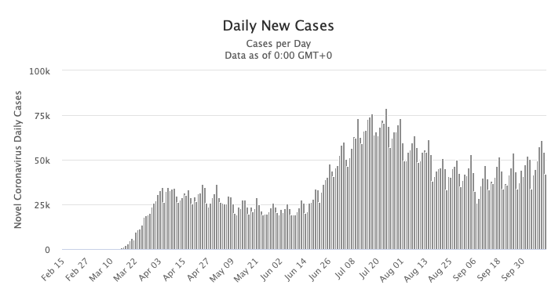

# The Second Wave of Coronavirus Can Be More Dreadful
Starting from this September, US is experiencing a **second wave** of coronavirus. Several states report new infections in the last seven days than they ever have in a one-week period. [This articles](https://www.forbes.com/sites/brucelee/2020/10/10/8-reasons-covid-19-coronavirus-could-get-worse-with-fall-second-wave/#6f759c702fca) states why the second wave of coronavirus *can be even worse*.
>Compared to indoor settings, the outdoors has more ventilation to blow away the virus and more space to allow people to stay at least 6 feet from each other. Staying outdoors during the late Fall and Winter may be more feasible in warmer locations. However, in colder locations, spending the majority of your time outdoors can be as practical as wearing just a thong to play ice hockey.

Here is a screenshot of daily new cases in the United States from [worldomter](https://www.worldometers.info):

Of note:

- [12 states](https://www.sciencealert.com/the-us-could-have-just-started-the-second-wave) just hit record new cases counts
- [NJ officials](https://whyy.org/articles/n-j-coronavirus-recovery-as-case-numbers-rise-officials-are-preparing-for-a-second-wave/) are preparing for a second wave
- Second wave of [layoffs](https://financialpost.com/news/economy/second-wave-of-layoffs-looms-as-covid-cases-climb-straining-hard-hit-industries) looms as COVID cases climb, straining hard-hit industries
